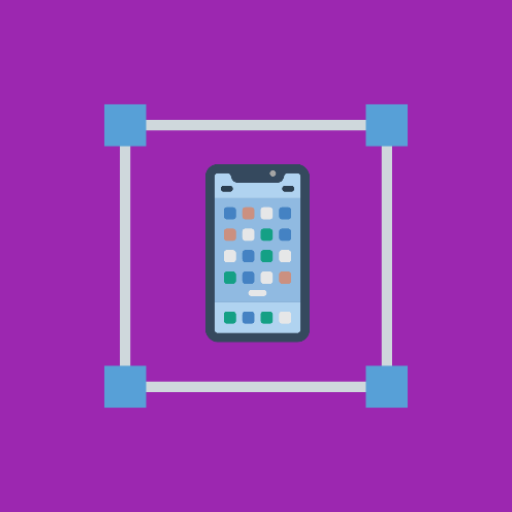
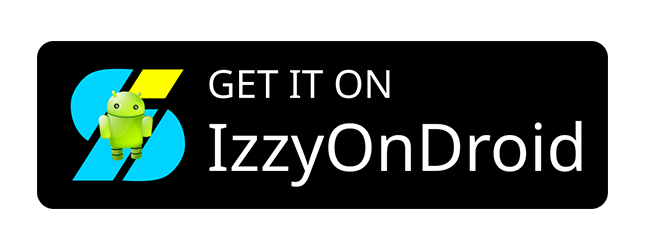

# CaptureSposed

With the release of Android 14, Google added an API to enable app developers to detect screenshots. This API has since been adopted by popular apps such as Snapchat.

CaptureSposed is an Xposed module that effectively disables this API as well as the screen recording detection API added in Android 15. The app provides in-app switches to control each hook. You can also add optional Quick Settings tiles that mirror the in-app switches.

**⚠️ WARNING:** CaptureSposed is intended for rooted devices running Android 14 or newer and requires Xposed. The required Xposed variant to use is LSPosed. Other Xposed variants will not work. This module cannot be guaranteed to work on all devices. In the worst case, it can cause a bootloop. Use at your own risk. Additionally, this module does not protect against screenshot detection from apps that use the pre-Android 14 approach of using file system listeners to detect screenshots ([ref 1](https://abangfadli.medium.com/shotwatch-android-screenshot-detector-library-6a75d7242109), [ref 2](https://viveksb007.wordpress.com/2017/11/10/how-snapchat-detects-when-screenshot-is-taken-hypothesis/)).

  
  
   
  
  

### To use CaptureSposed:
1. Install the [JingMatrix LSposed fork](https://github.com/JingMatrix/LSPosed). This requires your device to be rooted with Magisk or KernelSU. Installation instructions for LSPosed are available [here](https://github.com/JingMatrix/LSPosed?tab=readme-ov-file#install).
2. Install CaptureSposed.
3. Grant root access to CaptureSposed.
4. Activate the CaptureSposed module in the LSposed user interface.
5. Reboot your device and sign in.
6. Open the CaptureSposed app and use the switches to enable or disable screenshot and screen recording detection blocking. Use the Testing card to verify that detection is blocked when expected.
7. Optionally, add the Block Screenshot Detection and Block Recording Detection Quick Settings tiles from the tile editor. These tiles mirror the in-app switches.
